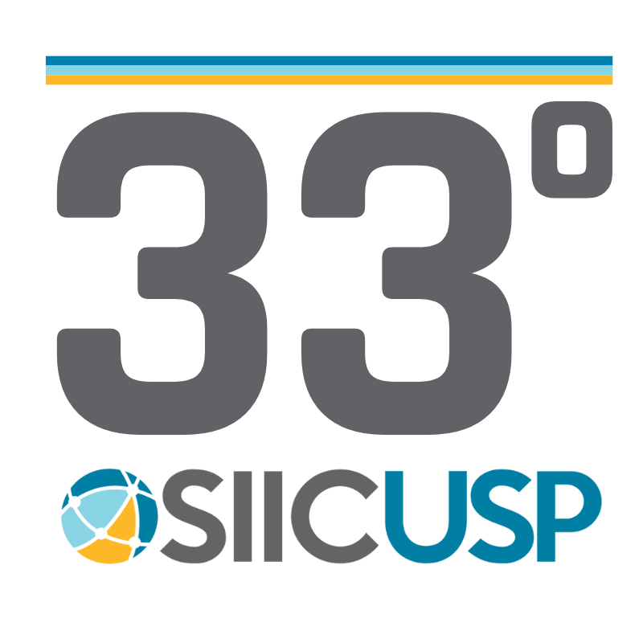

# Template LaTeX para Resumo da SIICUSP

Este repositório contém um template LaTeX para a submissão de resumos ao Simpósio Internacional de Iniciação Científica e Tecnológica da USP (SIICUSP). Até onde eu pesquisei, a USP só disponibiliza templates `.doc`, que são extremamente limitados para uma produção científica de qualidade. Templates LaTeX extraoficiais  encontrados na internet não seguiam as orientações do edital.

[Versão OverLeaf Disponível](https://www.overleaf.com/read/fzbndnntbrdh#80b766)

## Sobre o Template

Este template foi desenvolvido para facilitar a formatação do resumo conforme as normas da **33ª edição do SIICUSP (2025)**. Ele foi feito para ter a formatação idêntica à do template oficial e segue as orientações presentes no [Anexo I](Figures/regras_2025.pdf) do edital 2025.

Arquivos Raiz:
- `Main[PT-BR].tex`: Versão do resumo em português.
- `Main[EN-US].tex`: Versão do resumo em inglês.

Desde que eu entrei na USP, o template muda minimamente de ano para ano. A única mudança anual garantida é a do logo,lembre-se de mudar-lá para o seu ano. Logos de 2025:  
   
O template usa versões vetorizadas da logo criadas traçando-se o bitmap das disponibilizadas em `.png` 800x800 px, também presentes [aqui](Figures).

## Termos de Uso

Você tem **liberdade total para usar, modificar e distribuir este template como quiser**. Não é necessário dar créditos ao autor deste repositório.

> ⚠️ **Aviso Importante:**  
> Este template foi atualizado pela última vez na edição **33º SIICUSP (agosto/2025)**, baseado no edital oficial da época. Caso o SIICUSP atualize suas regras em edições futuras, não há garantias de conformidade.

O uso deste template é de **inteira responsabilidade do usuário**.

**Boa sorte no seu trabalho e na sua apresentação no SIICUSP!**

## Resolução de Problemas
1. `Package babel Error: Unknown option 'brazil'.`  
Você precisará instalar o pacote de línguas em português. Para Debian, a maneira recomendada de instalar pacotes adicionais é pelo gerenciador de pacotes do sistema:
```
sudo apt update
sudo apt install texlive-lang-portuguese
```
---

Qualquer sugestão ou correção, sinta-se livre para abrir um pull request ou issue.
